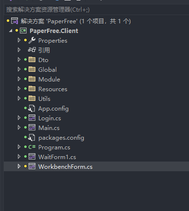

### 一.开发工具准备
```
1.Vs2022
2.DevExpress 插件版本22.2.3
3..NET Framework 4.7.2
```


## 二.项目结构说明
 


### 三.客户端项目规范说明
```
1.客户端不做任何业务处理。只负责模型组装、模型校验、数据渲染。
2.第三方硬件(如：高拍仪、CA字数签名验证)可以在客户端增加类库集成。
3.项目【类型状态、固定字符串】请自行定义枚举或者常量来代替项目的字符串。
4.项目命名尽量不要出现中文。以免出现未知错误。

```