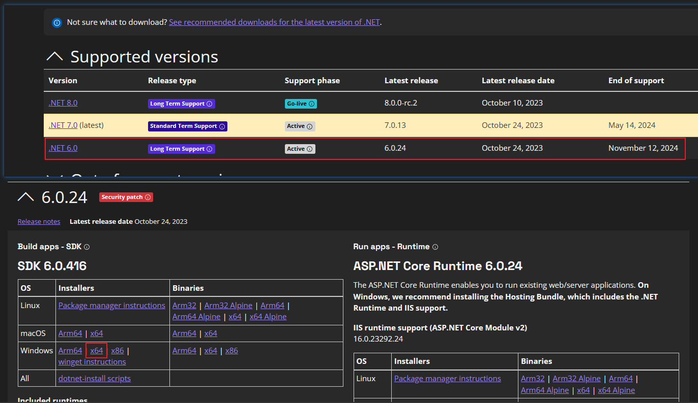
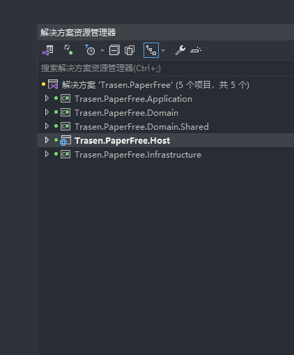

## 服务端项目启动说明

### 一.开发工具准备

 ```
 1. Vs2022、net Core 6.0

 2. Net Core  SDK 下载地址：https://dotnet.microsoft.com/en-us/download/dotnet
```
 

--------------------------------------------------------------------------------


### 二.项目结构说明

####项目结构说明
```
Application: 接口的实现，做业务编排
Domain：实体领域层，对应着数据库中的表，实体业务处理。
Domain Shared：可以理解为公共类，model，Core，consts，unities类
Infrastructure ：基础设施，主要对功能的实现，如数据仓储实现，实体配置类 第三方接口实现等.
Host：启动项，资源存放的地方
```


### 三.开发技能
.NET Core 、Oracle、EF Core、AutoMapper 、 MediatR 、Redis、CodeFirst、RabbitMQ 、Cap